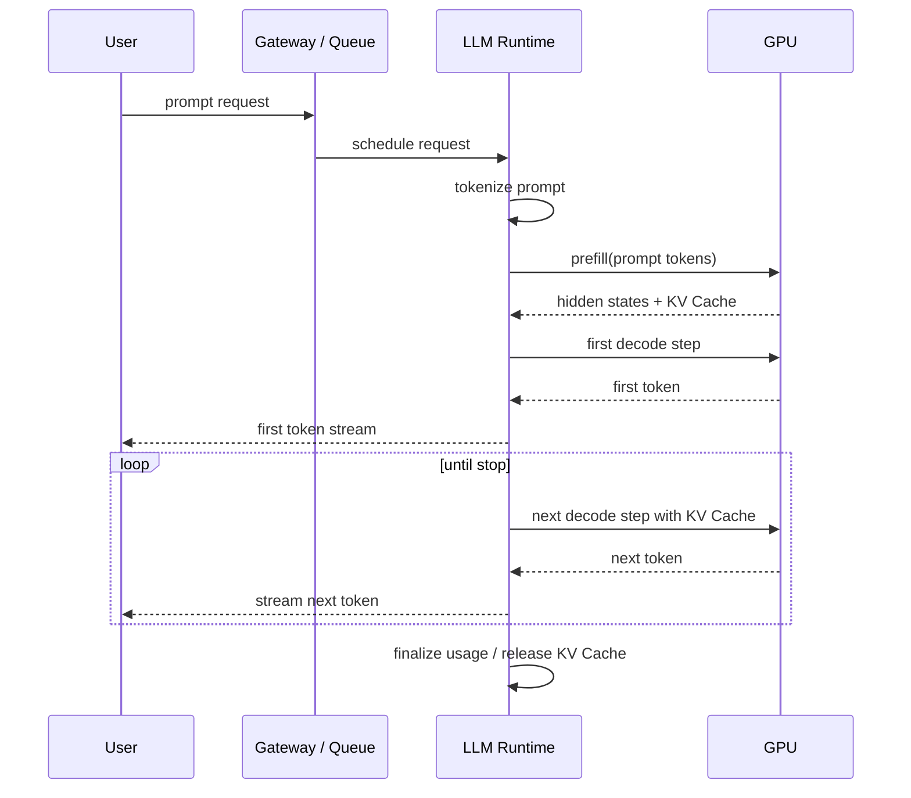

# 大模型推理生命周期与核心指标笔记

## 问题

整理这些概念的定义和关系：

- prefill
- decode
- TTFT
- TPOT
- throughput
- KV Cache
- continuous batching

并画一张从 prompt 输入到 token streaming 的推理生命周期图。

## 结论先行

大模型在线推理可以粗分成两个阶段：

1. `prefill`
   把整段 prompt 一次性送进模型，计算第一轮注意力与中间状态，并建立 KV Cache。
2. `decode`
   在已有 KV Cache 基础上，一次生成一个新 token，并把新 token 追加进上下文，循环直到结束。

大多数性能指标都围绕这两个阶段展开：

- `TTFT` 主要受 prefill 影响；
- `TPOT` 主要受 decode 影响；
- `throughput` 既受请求并发、batch 策略影响，也受 prefill / decode 比例影响；
- `KV Cache` 是 decode 能高效进行的前提；
- `continuous batching` 是把不同请求的 prefill 和 decode 更细粒度地混合调度，以提高 GPU 利用率的关键手段。

## 核心概念

### Prefill

`prefill` 指的是模型第一次处理用户输入 prompt 的阶段。

它的特点是：

- 一次要吃下整段输入；
- 需要计算整段输入上所有 token 的前向传播；
- 会建立注意力所需的 `K` / `V` 状态，也就是后面 decode 要复用的 KV Cache；
- 通常计算量大、延迟敏感，尤其是在 prompt 很长的时候。

可以把它理解成“先把上下文读完，并把可复用状态准备好”。

### Decode

`decode` 指的是模型在已有上下文基础上，逐 token 生成输出的阶段。

它的特点是：

- 一轮只生成一个 token；
- 每生成一个 token，就把这个 token 追加到上下文末尾；
- 会继续更新 KV Cache；
- 这个过程会反复循环，直到生成结束条件触发。

可以把它理解成“边写边往后推”。

### TTFT

`TTFT` 是 `Time To First Token`，即“从请求进入系统到第一个输出 token 返回给用户”的时间。

它通常包括：

- 请求排队时间；
- tokenizer 处理时间；
- prefill 计算时间；
- 第一个 decode step 时间；
- 返回首 token 的网络开销。

直觉上，用户感受到的“这个模型开始说话有多快”，主要就是 TTFT。

### TPOT

`TPOT` 是 `Time Per Output Token`，即“平均每个输出 token 的生成时间”。

它更贴近 decode 阶段的性能。

如果一个模型：

- TTFT 很低，但 TPOT 很高，

那么它会“开口很快，但后面说得慢”。

如果：

- TTFT 偏高，但 TPOT 很低，

那么它会“开口稍慢，但一旦开始输出，流得比较快”。

### Throughput

`throughput` 是吞吐量，描述单位时间内系统能处理多少工作。

在 LLM 推理里常见几种口径：

- requests / second
- input tokens / second
- output tokens / second
- total tokens / second

如果不说明口径，只说 throughput 高低，信息是不完整的。

因为：

- 长 prompt 场景更受 input tokens / second 影响；
- 长输出场景更受 output tokens / second 影响；
- 在线聊天和离线批处理对吞吐量的关心点也不同。

### KV Cache

`KV Cache` 是 Transformer 推理里缓存历史 token 注意力键值对的机制。

更具体一点：

- `K` 是 key；
- `V` 是 value；
- 每层注意力都会为历史 token 保存对应的 K/V；
- 后续 decode 时，不需要重新计算全部历史 token，只需要对新 token 计算并和历史 KV 做注意力。

它的作用是把 decode 的重复计算大幅减少。

没有 KV Cache，模型每生成一个 token 都要把整个上下文重新算一遍，成本会很高。

### Continuous Batching

`continuous batching` 指的是推理服务端不是等整批请求一起结束后再换下一批，而是动态地把新请求持续插入到 GPU 的执行批次中。

它解决的问题是：

- 请求到达时间不同；
- 输出长度不同；
- 有的请求还在 prefill；
- 有的请求已经进入 decode；
- 如果用静态 batch，GPU 会频繁空转或被最慢请求拖住。

continuous batching 的核心思想是：

> 谁准备好了就进下一轮调度，而不是整批人一起等。

这也是现代 LLM serving 系统里很关键的一层调度能力。

## 工作机制

### 从用户请求到模型输出

可以把在线推理生命周期理解成下面这条链路：

```mermaid
flowchart LR
  A["用户请求 / Prompt"] --> B["请求进入队列"]
  B --> C["Tokenizer"]
  C --> D["Prefill"]
  D --> E["建立 KV Cache"]
  E --> F["First Decode Step"]
  F --> G["返回首个 Token"]
  G --> H["循环 Decode"]
  H --> I["持续更新 KV Cache"]
  I --> J["Token Streaming"]
  J --> K["结束条件: eos / length / stop"]
```

### 更细一点的推理生命周期

## 它们之间的关系

### 1. 为什么 TTFT 通常先看 prefill

因为首 token 出来之前，系统至少要完成：

- prompt tokenize；
- prefill；
- 第一个 decode step。

如果 prompt 很长，prefill 往往是 TTFT 的主导项。

所以长上下文模型经常会出现：

- 理解能力不错；
- 但首字出来慢。

### 2. 为什么 TPOT 更看 decode

进入稳定输出阶段后，每次只是在已有上下文上生成下一个 token。

这时候：

- KV Cache 是否命中；
- batch 调度是否高效；
- GPU 是否被别的请求挤占；

都会直接影响 TPOT。

### 3. 为什么 KV Cache 是 decode 性能关键

decode 阶段之所以能做到“一步一个 token”，不是因为模型变轻了，而是因为历史 token 的 K/V 已经缓存下来，不必每次回头重算。

所以：

- 上下文越长，KV Cache 占用越大；
- batch 越大，KV Cache 总显存压力越大；
- 长上下文、高并发场景里，KV Cache 管理是 serving 系统的核心问题之一。

### 4. 为什么 continuous batching 能提高吞吐

静态 batching 的问题是：

- 一个 batch 里有人 prompt 长，有人 prompt 短；
- 有人快结束，有人还刚开始；
- GPU 调度会被最慢请求拖住。

continuous batching 允许：

- 新请求进入正在运行的批次；
- 已结束请求及时退出；
- prefill 和 decode 请求更细粒度地共享算力。

这能显著提高 GPU 利用率和整体 throughput。

## 常见误区

### 误区 1：TTFT 低就说明推理性能好

不对。

TTFT 只说明“开口快不快”。如果 TPOT 很高，整段输出仍然会很慢。

### 误区 2：throughput 越高，用户体验一定越好

不对。

高吞吐通常意味着系统更偏向总体效率优化，但单请求延迟不一定最优。

在线对话系统往往要在：

- TTFT
- TPOT
- throughput

之间做平衡。

### 误区 3：KV Cache 只是一个实现细节

不对。

KV Cache 直接决定：

- 长上下文可不可以扛；
- 并发能不能上去；
- 显存会不会爆；
- decode 成本能不能压住。

它不是小优化，而是 LLM serving 的核心机制。

### 误区 4：continuous batching 等于普通 batch

不对。

普通 batch 更像“这一波人一起进一起出”。

continuous batching 更像“运行中的队列不断换人，GPU 始终保持忙碌”。

## 和当前项目的关系

虽然我们这个仓库不是 GPU 推理引擎，但这些概念会直接影响我们后续怎么选和用模型服务：

1. 写作 agent 的 prompt 很长。
   技术骨架、参考文章、审稿上下文都会拉高 prefill 成本，所以 TTFT 很可能成为用户主观感知的瓶颈。

2. 多模型编排会放大吞吐问题。
   如果一个流程里要跑技术骨架、初稿、审稿三段调用，单次任务的推理成本不是一个请求，而是一串请求。

3. 后续如果做批量任务或定时生成，continuous batching 能力会变重要。
   因为定时任务一多，服务端是否能高效调度并发请求，会直接影响整体生成速度和成本。

4. 长上下文场景一定会碰到 KV Cache 与显存压力。
   尤其是文章生成、长资料分析、研究摘要这类任务，本质上对 prefill 和 KV Cache 都很敏感。

## 进一步学习方向

下一步适合继续写这几篇：

1. KV Cache 为什么会吃掉这么多显存
2. continuous batching 和 paged attention 是什么关系
3. 在线推理里 latency 和 throughput 为什么经常冲突
4. vLLM、TensorRT-LLM、SGLang 这类 serving 系统分别在解决什么问题
5. 长上下文模型为什么容易把 TTFT 拉高
