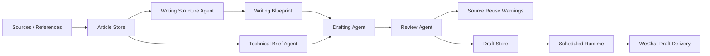
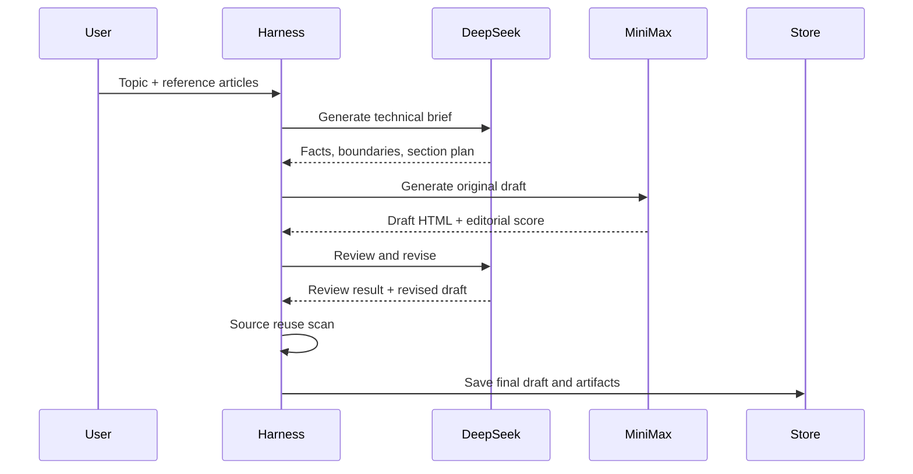
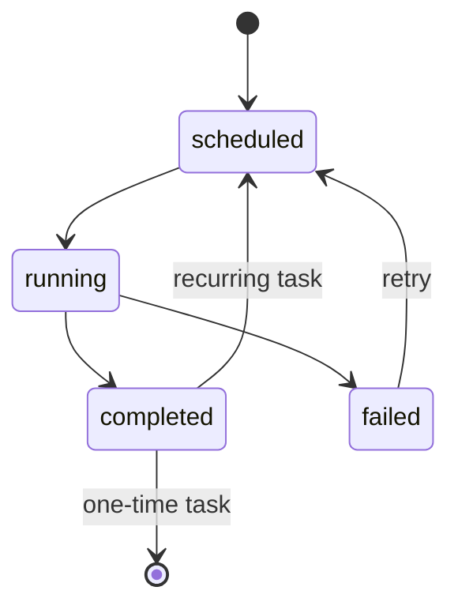
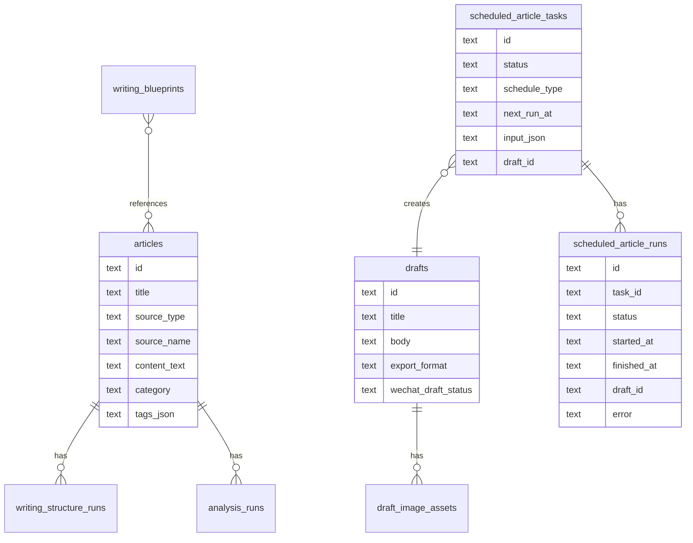

# Architecture Draft

## Core Architecture

## Multi-model Harness

## Scheduled Runtime State Machine

## Data Model Sketch

## Architecture Narrative

The system is built around a simple belief:

> A model call is not a workflow. A workflow needs state, role separation, review, persistence, and recovery.

The harness wraps model calls in explicit stages. Each stage has a contract:

- structure extraction turns examples into reusable writing assets;
- technical brief generation defines facts and boundaries;
- drafting turns the brief into public-facing prose;
- review catches factual risk, fake scenes, style problems, and CTA leakage;
- persistence makes the output inspectable;
- scheduling turns one-off generation into a runtime task.

This creates a system where the model is important, but not the only important part. The harness decides what the model sees, what it must output, where results are stored, and how failures are handled.

## Design Principles

1. The model is a component, not the system.
2. Intermediate artifacts should be inspectable.
3. Review should be a separate role, not a paragraph at the end of the prompt.
4. State should survive the request.
5. Failed tasks should have a recovery path.
6. Local-first should remain possible.
7. Cloud storage should be an implementation detail, not a rewrite.

