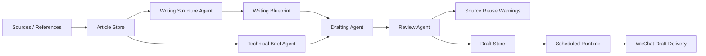
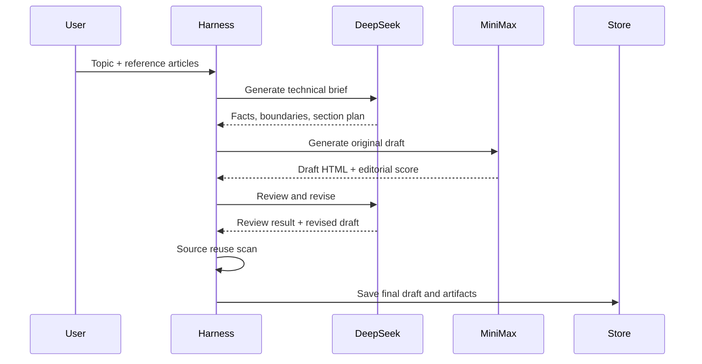
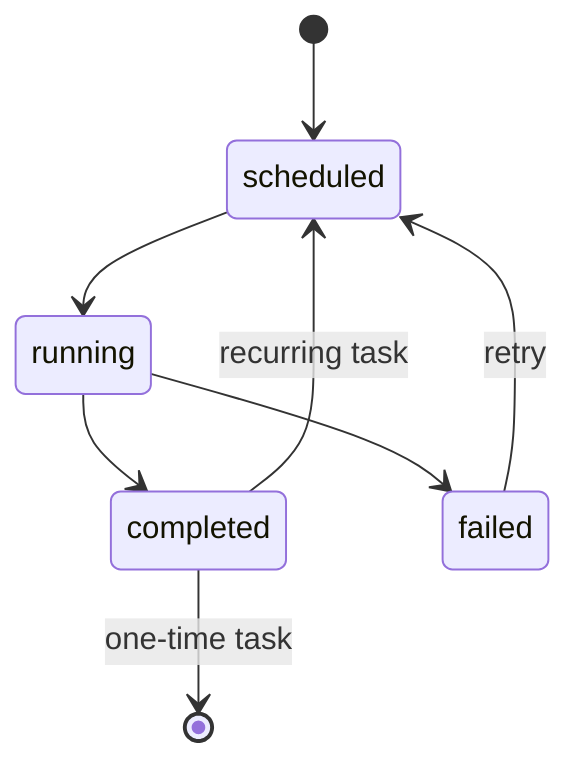
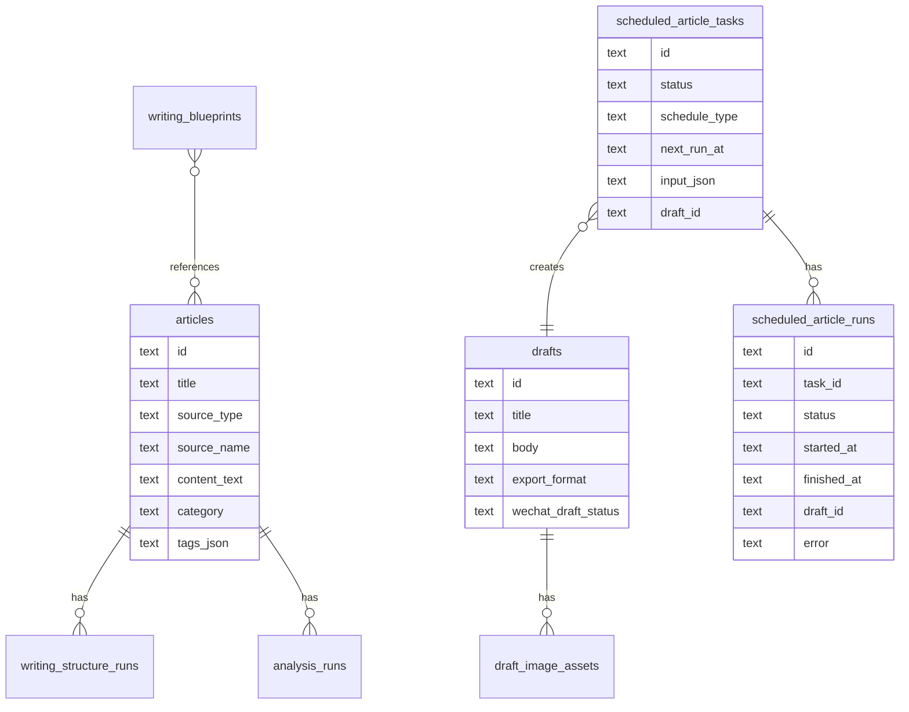

# 个人站点建设资料

这篇文档合并原个人站点目录下的首页内容、系统说明、架构草稿、维护说明和备注，作为历史归档资料保留。

## 个人站点归档索引

This directory is the working draft for a personal website focused on Agent Harness systems.

The site should not position William as a content operator, growth marketer, or newsletter writer. The core identity is:

> I build Agent Harness systems that make AI workflows stateful, reviewable, recoverable, and production-ready.

Chinese version:

> 我构建 Agent Harness，把模型调用变成有状态、可审稿、可恢复、可交付的生产流程。

## Goals

- Show engineering taste and system-building ability.
- Make the WeChat OA project look like a production AI workflow harness, not a content tool.
- Present concrete artifacts: architecture, state machines, data models, tests, and workflow design.
- Keep the site easy to maintain through Markdown first, then publish through GitHub Pages or a small static app.

## Draft Files

- `home.md`: homepage copy and first-screen positioning.
- `systems.md`: selected systems and project case studies.
- `architecture.md`: system diagrams and technical narrative.
- `notes.md`: writing topics that reinforce the Harness identity.
- `maintenance.md`: how to maintain the site over time.

## Recommended Navigation

- Home
- Systems
- Architecture
- Notes
- Now
- Contact

Avoid navigation labels such as:

- 公众号
- 小红书
- 运营
- 爆款
- 私域

Prefer labels such as:

- Systems
- Harness
- Runtime
- Pipelines
- Notes
- Artifacts

## 首页内容

## First Screen

### English

William

Agent Harness Builder

I build runtime systems that turn model behavior into reliable workflows.

Focus:

- Agent Harness architecture
- Multi-model workflow orchestration
- State, review, retry, and recovery systems
- Production-grade AI workstations

Current work:

- Building a local-first AI workflow workstation for long-form research-to-draft generation.
- Designing multi-model writing pipelines with technical brief, drafting, review, and persistence stages.
- Studying how Agent systems move from impressive demos to production-grade workflows.

### Chinese

William

AI Agent Harness 构建者

我专注把大模型能力封装成可运行、可审稿、可恢复、可交付的生产系统。

关注方向：

- Agent Harness 架构
- 多模型工作流编排
- 状态、审稿、重试与恢复系统
- 生产级 AI 工作台

最近在做：

- 构建一个本地优先的 AI 工作流工作台，用于从资料研究到长文草稿的生成。
- 设计多模型写作流水线：技术骨架、初稿生成、审稿修订、草稿持久化。
- 研究 Agent 系统如何从演示能力走向生产流程。

## Short Bio

### English

I am interested in the engineering layer between foundation models and real products: state management, tool execution, review loops, scheduling, persistence, and recovery.

My work focuses on turning one-off model calls into controllable systems. I care less about whether a model can produce one impressive response, and more about whether a workflow can be repeated, inspected, resumed, and improved.

### Chinese

我关注的是基础模型和真实产品之间的工程层：状态管理、工具执行、审稿循环、任务调度、持久化和异常恢复。

我的工作重点不是让模型偶尔生成一次漂亮结果，而是把一次模型调用变成可控制、可检查、可恢复、可持续改进的系统。

## Core Claim

### English

The useful part of an Agent system is rarely just the model. It is the harness around the model: the state, tools, memory, review, scheduling, and recovery layer that makes model behavior usable in production.

### Chinese

Agent 系统真正有价值的部分，往往不只是模型本身，而是模型之外的 Harness：状态、工具、记忆、审稿、调度和恢复层。它决定模型行为能否在生产流程中稳定使用。

## Featured Systems

1. WeChat OA Agent Workstation
   - A local-first Agent Harness for long-form AI workflows.
   - Orchestrates research ingestion, multi-model drafting, review, persistence, scheduling, and publishing workflows.

2. Multi-model Writing Harness
   - DeepSeek for technical brief and review.
   - MiniMax for draft generation.
   - Persistent draft store and review artifacts.

3. Scheduled Generation Runtime
   - Scheduled tasks, run history, retries, failure states, and local/Supabase storage paths.

## Contact Block

GitHub: `LianWeiSQ`

Email: add later

Current project: `wechat-oa`

## 系统说明

## Selected System 1: WeChat OA Agent Workstation

### One-line Description

A local-first Agent Harness that turns research materials into structured, reviewable, and schedulable long-form AI drafts.

### Problem

Single model calls are easy. Reliable long-form AI workflows are not.

A useful workflow needs to:

- ingest and store reference materials;
- extract reusable structure;
- generate a technical brief before writing;
- draft with one model and review with another;
- persist intermediate artifacts;
- keep drafts editable;
- schedule generation tasks;
- retry failed runs;
- support local-first and cloud storage paths.

Without a harness, generation becomes a fragile prompt experiment. With a harness, model calls become a system.

### System Shape

```text
Sources
  -> Article Store
  -> Writing Structure Agent
  -> Technical Brief Agent
  -> Drafting Agent
  -> Review Agent
  -> Draft Store
  -> Scheduled Runtime
  -> WeChat Draft Delivery
```

### Key Capabilities

- Article import and local knowledge library.
- Writing structure extraction.
- Writing blueprints.
- Technical brief generation.
- Multi-model drafting.
- Review and revision agent.
- Source reuse warning.
- Draft persistence.
- Scheduled generation tasks.
- Retry and run history.
- SQLite and Supabase storage paths.
- Settings for main model and review model.
- Test coverage for parsing, settings, writing pipeline, and scheduled generation.

### Engineering Decisions

1. Separate drafting model and review model.

   Draft generation benefits from fluency and style control. Review needs stricter factual boundaries, compression, and risk detection. Treating them as different roles makes the workflow easier to reason about.

2. Persist intermediate artifacts.

   The technical brief, draft, review result, and final draft should not disappear inside a single model response. Persisted artifacts make the workflow inspectable and maintainable.

3. Keep local-first storage.

   SQLite keeps the system easy to run and test locally. Supabase support makes it possible to move toward cloud storage without rewriting the core workflow.

4. Model calls are not the product.

   The product is the controlled workflow around model calls: state, settings, scheduling, retries, and review.

### Current Artifacts

- `src/lib/writing-agent.ts`
- `src/lib/wechat-generator.ts`
- `src/lib/scheduled-generation.ts`
- `src/lib/db.ts`
- `src/lib/supabase-stores.ts`
- `src/components/workbench.tsx`
- `src/components/generate-studio.tsx`
- `src/components/settings-page.tsx`

### Validation

- Unit tests for writing agents.
- Unit tests for scheduled generation.
- Component tests for workbench and generation studio.
- Full app build through Next.js.

## Selected System 2: Multi-model Writing Harness

### One-line Description

A role-based writing pipeline that uses different models for technical brief, draft generation, and review.

### Why It Exists

Long-form AI generation fails when a single model is asked to be researcher, writer, editor, reviewer, and fact-checker at once.

This harness separates responsibilities:

```text
DeepSeek
  -> technical brief, fact boundaries, section plan

MiniMax
  -> fluent first draft, narrative flow, public-facing prose

DeepSeek
  -> review, factual risk detection, compression, revision
```

### Pipeline

```text
Topic + References
  -> TechnicalBrief
  -> OriginalDraft
  -> DraftReview
  -> RevisedDraft
  -> SourceReuseWarnings
  -> LocalDraft
```

### Outputs

- `targetReader`
- `topicJudgment`
- `coreClaim`
- `verifiedFacts`
- `sourceBoundaries`
- `sectionBrief`
- `riskFlags`
- `styleInstructions`
- `editorialScore`
- `factIssues`
- `fakeSceneIssues`
- `styleIssues`
- `revisionSummary`

### What It Demonstrates

- Role separation in model orchestration.
- Factual boundary control.
- Editorial scoring.
- Reviewable intermediate states.
- Better system behavior than one-shot prompting.

## Selected System 3: Scheduled Generation Runtime

### One-line Description

A small runtime for scheduling, running, retrying, and tracking AI draft generation tasks.

### State Machine

```text
scheduled
  -> running
    -> completed
    -> failed
      -> retry
        -> scheduled
```

### Tables

- `scheduled_article_tasks`
- `scheduled_article_runs`
- `drafts`
- `settings`

### Why It Matters

AI systems that only work when a user clicks a button are still demos. Scheduled generation introduces runtime concerns:

- when should a task run;
- what happens when generation fails;
- how many times has it run;
- where is the generated draft stored;
- how can a failed run be retried;
- how can the UI show run history.

This is a small but important step from prompt tooling toward production workflow systems.

## 站点架构

## Core Architecture



## Multi-model Harness



## Scheduled Runtime State Machine



## Data Model Sketch



## Architecture Narrative

The system is built around a simple belief:

> A model call is not a workflow. A workflow needs state, role separation, review, persistence, and recovery.

The harness wraps model calls in explicit stages. Each stage has a contract:

- structure extraction turns examples into reusable writing assets;
- technical brief generation defines facts and boundaries;
- drafting turns the brief into public-facing prose;
- review catches factual risk, fake scenes, style problems, and CTA leakage;
- persistence makes the output inspectable;
- scheduling turns one-off generation into a runtime task.

This creates a system where the model is important, but not the only important part. The harness decides what the model sees, what it must output, where results are stored, and how failures are handled.

## Design Principles

1. The model is a component, not the system.
2. Intermediate artifacts should be inspectable.
3. Review should be a separate role, not a paragraph at the end of the prompt.
4. State should survive the request.
5. Failed tasks should have a recovery path.
6. Local-first should remain possible.
7. Cloud storage should be an implementation detail, not a rewrite.

## 维护说明

## What This Site Should Prove

The site should prove that William can design and build Agent Harness systems.

It should answer:

- What systems has he built?
- What architecture does he use?
- How does he think about state, review, recovery, and persistence?
- What artifacts can prove the work?
- What is he building now?

## Update Rhythm

Weekly:

- Add one short Now update.
- Add one engineering note idea or link.
- Update active project status.

Monthly:

- Promote one system improvement to a case study.
- Add a diagram if the architecture changed.
- Archive old notes that no longer represent the current direction.

Quarterly:

- Rewrite the homepage positioning.
- Choose the top 3 systems only.
- Remove weak or outdated claims.

## What To Add Over Time

- Screenshots of the workstation UI.
- Architecture diagrams rendered as images.
- A short demo video.
- Links to merged PRs.
- Test/build badges.
- Public GitHub repo links.
- A downloadable architecture PDF.

## What Not To Add

- Vanity metrics without proof.
- Generic AI slogans.
- Content-operation positioning.
- Too many unfinished projects.
- Screenshots that look like internal clutter.
- Draft articles that are not edited.

## Publishing Options

### Option A: GitHub Pages + al-folio

Best if the site should look like an academic/technical personal homepage.

Pros:

- proven template;
- Markdown-first;
- easy GitHub Pages deployment;
- good for notes, projects, selected work.

Cons:

- Ruby/Jekyll dependency;
- less flexible for custom interactive visuals.

### Option B: Static Next.js Site

Best if the site should reuse this repo's React/Next stack.

Pros:

- same stack as current project;
- easy to build custom diagrams and UI;
- can later integrate live project demos.

Cons:

- more code to maintain;
- needs design work.

### Option C: Plain Markdown + GitHub README

Best for the fastest first public version.

Pros:

- no build system;
- easy to maintain;
- can ship immediately.

Cons:

- not as polished;
- weaker personal-brand surface.

## Recommended Path

Start with this Markdown draft.

Then build a small static personal site with:

- homepage;
- systems page;
- architecture page;
- notes page;
- contact page.

Only after the content feels stable should we decide whether to publish through al-folio or a custom Next.js static site.

## 备注

These are note topics that reinforce the Agent Harness identity.

## Core Notes

1. Why Agent Products Need a Harness Layer

   Main claim: model capability sets the ceiling, but Harness design sets the production floor.

2. State Source Design for Long-running Agents

   Main claim: long-running agents need a single source of truth outside the model context.

3. Multi-model Review Workflows

   Main claim: a serious generation workflow should separate researcher, writer, and reviewer roles.

4. Retry and Recovery in Scheduled AI Tasks

   Main claim: AI systems become more real when they need run history, failure states, and retries.

5. From Prompt Experiments to Agent Runtimes

   Main claim: production AI products are not prompt collections; they are runtime systems.

## Case-study Notes

1. Building a Local-first Agent Harness for Long-form Workflows
2. How Technical Briefs Improve AI Draft Quality
3. Why Review Agents Should Own Fact Boundaries
4. What Scheduled Generation Teaches About AI Runtime Design
5. SQLite First, Supabase Later: A Practical Storage Path

## Style Rules

- Do not write like a marketing landing page.
- Do not claim generic AI expertise.
- Use concrete system artifacts.
- Prefer diagrams, state machines, and data models.
- Use first-person only when it clarifies an engineering decision.
- Avoid hype language such as revolutionary, game-changing, unlock, disrupt.
